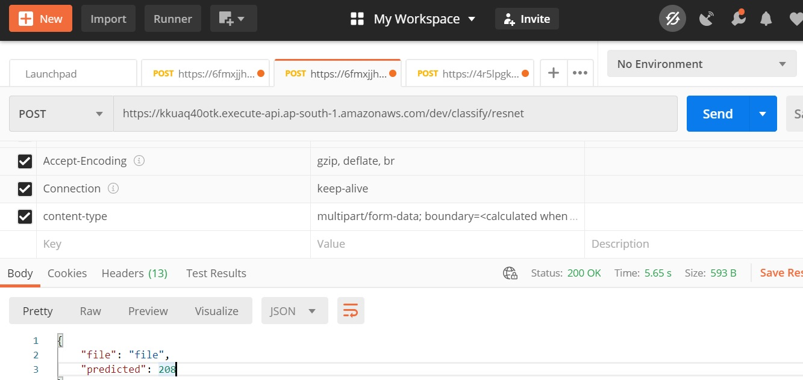

# Deployed Pytorch models Resnet34 and MobilenetV2 as a docker image In AWS-Lambda using Serverless framework .

## Summary

### AWS Endpoint URL for Resnet34

POST https://kkuaq40otk.execute-api.ap-south-1.amazonaws.com/dev/classify/resnet

### AWS Endpoint URL for MobilenetV2

POST https://4r5lpgknic.execute-api.ap-south-1.amazonaws.com/dev/classify/mobilenet

Complete Docker project available in [MobilenetV2_Lambda_Deployment](MobilenetV2_Lambda_Deployment)

MobilenetV2 pre-trained model generated using [pytorch_vision_mobilenet_v2.ipynb](pytorch_vision_mobilenet_v2.ipynb)

### Insomania Screenshot

### Postman Screenshot

#### Input Image

