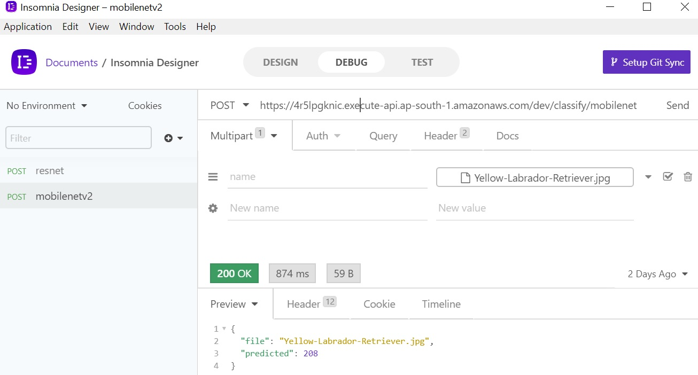

# Deployed Pytorch models Resnet34 and MobilenetV2 as a docker image In AWS-Lambda using Serverless framework .

## Summary

AWS Lambda can do heavy lifting things, which otherwise needed high memory infrastructure. AWS Lambda has limitations with respect to the upload size. One solution to tackle this is create a requirements.txt that can download the necessary dependencies.

AWS Lambda works as a container. So I deployed container in Lambda. What is the benefit?..One docker image can have pytorch models and another can have tensorflow or keras. One can have python2.x dependencies another can have Python3.x

In this example, I choose the opensource serverless framework , created docker image and deployed in AWS lambda. Serverless framework creates deployment stack using serverless.yml. My serverless.yml stack includes S3, Amazon API Gateway, AWS Cloudwatch for logs, AWS Lambda and ofcource AWS IAM services. handler.py is the entry point that executes AWS Lamda function with Pytoch models resnet34 and Mobilenetv2. 

One bad experience is upload time it took, due to limited internet bandwidth.

### AWS Endpoint URL for Resnet34

POST https://kkuaq40otk.execute-api.ap-south-1.amazonaws.com/dev/classify/resnet

### AWS Endpoint URL for MobilenetV2

POST https://4r5lpgknic.execute-api.ap-south-1.amazonaws.com/dev/classify/mobilenet

Complete Docker project available in [MobilenetV2_Lambda_Deployment](MobilenetV2_Lambda_Deployment)

MobilenetV2 pre-trained model generated using [pytorch_vision_mobilenet_v2.ipynb](pytorch_vision_mobilenet_v2.ipynb)

### Insomania Screenshot

### Postman Screenshot

#### Input Image

